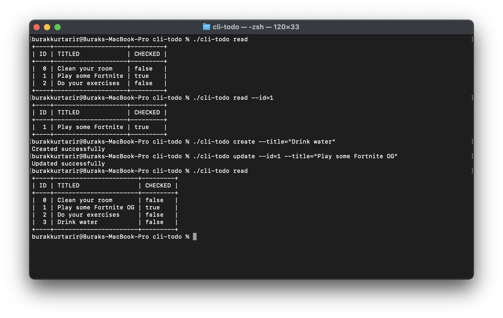

# CLI To-Do

Terminal app developed in Go. Used <a href="https://github.com/spf13/cobra">cobra-cli</a> for CLI interactions. Used <a href="https://github.com/jedib0t/go-pretty">go-pretty</a> for printing results as a table view. Manage your todos in terminal!

## How to use

Create new todo:

```bash
./cli-todo create --title="Drink water"
```

<hr>
Read todos:

```bash
./cli-todo read
```

<hr>
Read todo by id:

```bash
./cli-todo read --id=1
```

<hr>
Update todo:
(<strong>--checked</strong> parameter is true by default)

```bash
./cli-todo update --id=1 --title="Play some Fortnite OG"
```

<hr>
Delete todo:

```bash
./cli-todo delete --id=1
```

## Preview


